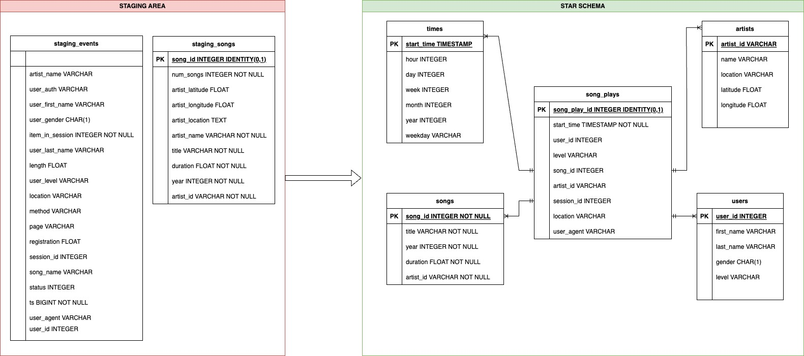

# Sparkify ETL

Welcome to Sparkify ETL!!

## About this Project

_"The objective of this project is to exercise ETL and Data-warehouse concepts as part of my [Data Engineer Nanodegree](https://www.udacity.com/course/data-engineer-nanodegree--nd027?gclid=CjwKCAjwrranBhAEEiwAzbhNtX2u0Cgqf42F_UgP68QhJ381lLzPJXH_MUBvquNKyhMGQZfr34Lh4hoCJKoQAvD_BwE&utm_campaign=19167921312_c_individuals&utm_keyword=udacity%20data%20engineering_e&utm_medium=ads_r&utm_source=gsem_brand&utm_term=143524475719)"._ 
The project consists of an ETL pipeline to build a Data-warehouse in AWS following the schemas bellow:



## Why?

This project is part of my personal portfolio, so, I'll be happy if you could provide me any feedback about the project, code, structure or anything that you can report that could make me a better developer!

Email-me: harrisonhenrisn@gmail.com

Connect with me at [LinkedIn](https://linkedin.com/in/harrison-henri-dos-santos-nascimento

## Local installation and configuration

To install and run the project locally, first, add a .env file (based on the .env.example)!

1. Install the python (minimum version of the project.toml at least)

2. Install the dependencies with:

```=sh
pip install poetry
python -m venv venv
poetry install
```

3. Run with:

```=sh
jupyter notebook
```

## Built with

<div>


<br /><br /><br /><br />
</div>
